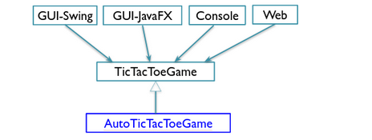

# Sprint 1

**Historia de usuario 1:** Como jugador, necesito un tablero vacío de 3 x 3 para comenzar un juego TicTacToe.

**Historia de usuario 2:** Como jugador X, necesito colocar una ficha en un tablero tic-tac-toe para poder hacer un movimiento.

**Historia de usuario 3:** Como jugador, necesito saber si el juego termina después de cada movimiento.

## Criterios de Aceptación

**Pregunta** Escribir los siguientes criterios de aceptación.

```
AC 1.1 Tablero vacío
Cuando
Entonces
Y
```

```
AC 1.2 Referencia de fila no válida
Dado
Cuando
Entonces
```

```
AC 1.3 Referencia de columna no válida
Dado 
Cuando 
Entonces
```

**Respuestas**
```
AC 1.1 Tablero vacío
Cuando inicio un juego de TicTacToe
Entonces se muestra un tablero de 3 x 3 vacío en la pantalla
Y puedo colocar mis movimientos en las casillas del tablero.
```

```
AC 1.2 Referencia de fila no válida
Dado que estoy en mi turno para colocar una ficha en el tablero
Cuando intento colocar una ficha en una fila que no existe en el tablero (fuera de los límites)
Entonces se muestra un mensaje de error indicando que la referencia de fila no es válida.
```

```
AC 1.3 Referencia de columna no válida
Dado que estoy en mi turno para colocar una ficha en el tablero
Cuando intento colocar una ficha en una columna que no existe en el tablero (fuera de los límites)
Entonces se muestra un mensaje de error indicando que la referencia de columna no es válida.
```

Para escribir una prueba, necesitamos tomar las siguientes decisiones: 

**Preguntas**
- ¿Cuál es el tipo de datos de las celdas del tablero? 
- ¿Qué valor representa `empty`? 
- ¿Cómo obtener una celda de tablero dada?
- ¿Cuál es el tipo de datos de turn de 'X'? 
- ¿Cómo obtener el estado de `turn`? 

**Respuestas**
- El tipo de datos de las celdas del tablero en este caso es `int`.
- El valor de `empty` es 0.
- Se puede obtener el valor de una celda en el tablero utilizando el método `getCell(int row, int column)`.
- Se ha definido como una variable de tipo `char` que representa el turno del jugador actual ('X' o 'O').
- Podemos utilizar el metodo `getTurn()` para obtener el estado de turn. 

**Pregunta** 
Crear pruebas a partir de los criterios de aceptación.

**Respuesta**

```java
public class TestEmptyBoard {
  
  private Board board = new Board ( );
  
  // Criterio de aceptación 1.1
  @Test
  public void  testNewBoard() {
    for (int row =0; row < 3; row ++) {
      for (int column = 0; column < 3; column ++){
	      assertEquals(" ", board.getCell(row, column), 0);
	    }
    }
    assertEquals(" ", board.getTurn( ), 'X')
  }
  
  // Criterio de aceptación 1.2 
  @ Test
  public void testInvalidRow(){
    assertEqual(" ", board.getCell(3, 0), -1);
  }

  // criterio de aceptación 1.3
  @ Test
  public void testInvalidColumn(){
    assertEqual(" ", board.getCell(0, 3), -1);
  }
}
```

## Programación en pares

**Pregunta** Explica el funcionamiento de los siguientes código dentro del sprint1.

Clase TestBoardConsole
```java
public class TestBoardConsole {
  private Board board;

  @Before
  public void setUp() throws Exception {
    board = new Board();
  }

  @After
  public void tearDown() throws Exception {
  }

  @Test
  public void testEmptyBoard() {
    new Console(board).displayBoard();
  }
}
``` 

Clase Console
```java
public class Console {
  private Board board;

  public Console(Board board) {
    this.board = board;
  }

  public void displayBoard() {
    for (int row = 0; row<3; row++) {
      System.out.println("-------");
      System.out.print("|"+ board.getCell(row, 0));
      System.out.print("|"+ board.getCell(row, 1));
      System.out.print("|"+ board.getCell(row, 2));
      System.out.println("|");
    }
    System.out.println("-------");
  }
}
```

**Respuestas**

**Clase TestBoardConsole:** es una clase de prueba para probar la funcionalidad de visualización del tablero en la consola.
- En el método `SetUp()`, se crea una instancia de la clase `Board` y se asigna a la variable `board` antes de cada prueba.
- En el método `tearDown()`, no tiene ninguna implementación en este caso, pero se suele utilizar para destruir los objetos luego de la ejecución.
- En el método `testEmptyBoard()`, se crea una instancia de la clase `Console` y se le pasa como parámetro la variable `board` que contiene una instancia de la clase `Board`. Luego se llama al método `displayBoard()` de la clase `Console` para visualizar el tablero vacio en la consola.

**Clase Console:** es una clase que contiene la funcionalidad de visualización del tablero en la consola.
- El constructor de la clase recibe como parámetro una instancia de la clase `Board` y se asigna a la variable `board`.
- En el método `displayBoard()`, se recorre el tablero y se imprime en la consola el tablero.

**Pregunta** ¿se necesita refactorización?

**Respuesta** No se necesita refactorización, debido a que el codigo es bastante sencillo y entendible, quizas se puede mejorar la legibilidad del codigo, pero no es necesario.

## Cobertura de código 

```java
public class TestEmptyBoard {
    private Board board = new Board ( );
    // Criterio de aceptación 1.1
   @ Test
    public void  testNewBoard() {
         for (int row =0; row < 3; row ++) {
            for (int column = 0; column < 3; column ++){
	assertEquals(“ “, board.getCell(row, column), 0);
	}
         }
         assertEquals(“ “, board.getTurn( ), 'X')
      }
}
``` 
Ahora escribimos un nuevo código de producción para que pase la prueba. El nuevo código con información de cobertura se muestra a continuación.

```java
public class Board {
     private int[] grid
     private char turn = 'X';
     public Board(){
         grid = new int[3][3];  
       }
      public int getCell(int row, int column){
            if (row >=0 && row < 3 && column >=0 && column < 3)
                       return grid[row][column];
            else
                    return -1
            }
         public char getTurn() {
                  return turn;
     }
}
``` 
**Pregunta:** Realiza la cobertura de código. Explica tus respuestas.

**Respuesta:**

```java
public class TestEmptyBoard {
  private Board board = new Board();

  // Criterio de aceptación 1.1
  @Test
  public void testNewBoard() {
    for (int row = 0; row < 3; row++) {
      for (int column = 0; column < 3; column++) {
        assertEquals(0, board.getCell(row, column)); // Corregido: comparar con valor entero 0
      }
    }
    assertEquals('X', board.getTurn()); // Corregido: comparar con char 'X'
  }   
}
```

```java
public class Board {
  private int[][] grid; // Corregido: especificar tipo de datos int[][] en la declaración del arreglo
  private char turn = 'X';

  public Board() {
    grid = new int[3][3];
  }

  public int getCell(int row, int column) {
    if (row >= 0 && row < 3 && column >= 0 && column < 3) {
      return grid[row][column];
    } else {
      return 0; // Corregido: retornar 0 para indicar celda vacía
    }
  }

  public char getTurn() {
    return turn;
  }
}	
```	

## Sprint 2 

**Historia de usuario 2:** Como jugador X, necesito colocar X en una celda vacía para poder hacer un movimiento.

**Historia de usuario 3:** Como jugador O, necesito colocar O en una celda vacía para poder hacer un movimiento.

**Pregunta** Escribir los siguientes criterios de aceptación.

```
AC 2.1 Un movimiento X válido 
Dado 
Cuando  
Entonces
```

```
AC 2.2 Un movimiento X ilegal en una celda ocupada
Dado 
Cuando  
Entonces
Y
```

```
AC 2.3 Un movimiento X ilegal fuera del tablero 
Dado 
Cuando  
Entonces
Y
```

**Respuestas**

```
AC 2.1 Un movimiento X válido 
Dado un juego en curso con el turno de X 
Cuando el jugador X hace un movimiento válido 
Entonces X se coloca en la celda Y el turno se cambia a 0 
```

```
AC 2.2 Un movimiento X ilegal en una celda ocupada
Dado un juego en curso con el turno de X
Cuando el jugador X intenta hacer un movimiento en una celda ya ocupada por X u O
Entonces no se realiza el movimiento y el turno de X no cambia.
```

```
AC 2.3 Un movimiento X ilegal fuera del tablero
Dado un juego en curso con el turno de X
Cuando el jugador X intenta hacer un movimiento fuera del tablero
Entonces no se realiza el movimiento y el turno de X no cambia.
```

```
AC 3.1 Un movimiento O válido
Dado un juego en curso con el turno de O 
Cuando el jugador O hace un movimiento válido
Entonces se coloca O en la celda
Y el turno se cambia a X 
```

```
AC 3.2 Un movimiento O ilegal en una celda ocupada 
Dado un juego en curso con el turno de O 
Cuando el jugador O hace un movimiento ilegal dentro del tablero 
Entonces no se cambia la celda Y no se cambia el turno  
```

```
AC 3.3 Un movimiento O ilegal fuera del tablero 
Dado un juego en curso con el turno de O 
Cuando el jugador O hace un movimiento ilegal fuera del tablero 
Entonces la celda no se cambia.
```

## Sprint 3
**Pregunta (V/F)** 
La secuencia de cuatro movimientos, `X (0,0), O (1,1), X (0,1), O (1,0)` no cumple la  necesidad. 

**Pregunta**

Para hacer que `testXWon` pase, `updateGameState` se enfoca en los escenarios `CROSS_WON`. Indica  al menos tres pruebas para `AC4.1` para cubrir tres X seguidas de manera horizontal, vertical y diagonal. 

Muestra que el método `testXWon` anterior ha cubierto `AC4.2` y `AC 4.4` y que el juego continuó hasta la jugada ganadora `board.makeMove (0, 2)`. 

¿`AC4.3` es similar a `AC 4.1` ?. ¿Se trata de los escenarios `NAUGHT_WON`?. 

¿Toda las pruebas para `AC4.1-AC4.5` permitirán completar la clase de `Board`?. 

### Refactorización 

Hasta ahora, hemos usado `Board` como el nombre de clase del código de producción. Su interfaz se muestra a continuación: 

``` 
public enum Cell {EMPTY, CROSS, NOUGHT}
	public enum GameState {PLAYING, DRAW, CROSS_WON, NOUGHT_WON}
	public Board();
	public void initBoard();
	public int getTotalRows();
	public int getTotalColumns();
	public Cell getCell(int row, int column);
	public char getTurn();
	public void makeMove(int row, int columns);
	public GameState getGameState();
```

**Pregunta** ¿ Cuál es el problema de initialBoard  y por que le cambiamos el nombre a `resetGame`. 


### Evolución de la implementación



Aquí hay algunas especificaciones:

- La herencia y el principio abierto-cerrado 

- `AutoTicTacToe`  extiende `TicTacToeGame` 

- Realiza el primer movimiento automático en el constructor si la computadora juega primero (`AC 5.1` ) 

- Modificación
   
   * resetGame (`AC 5.1`) 
   * Hace el primer movimiento automático si la computadora juega primero `makeMove` (`AC 5.2-5.4`)
   * Termina con un movimiento automático si el juego no ha terminado.

Para implementar las características anteriores, podemos crear una subclase de `TicTacToeGame` e implementar la historia de usuario 5 (el primer movimiento X) en el constructor y `resetGame`.

La elección de un movimiento automático en la historia de usuario  ocurre justo después de que el jugador humano se mueva. Podemos lograr esto sobreescribiendo `makeMove` e implementando los criterios de aceptación `5.2-5.4` por métodos individuales. 

**Pregunta:** Verifica esto en el código del paquete del proyecto TicTacToe entregado.

