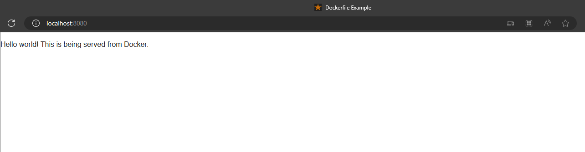
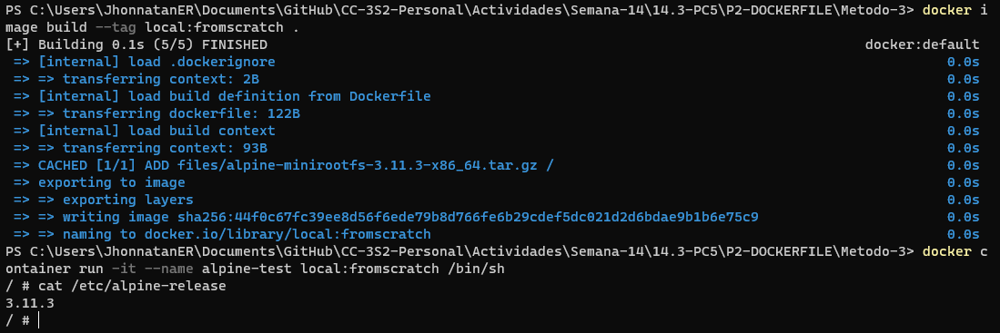

# Practica Calificada 5

Autor: Jhonnatan Espinoza Rojas

Fecha: 05/07/2023

## Ejercicio 1 (7 puntos)

Primero creamos la base de datos y la tabla que usaremos en postgresql

```sql 
CREATE DATABASE cc3s2;
```

```sql
CREATE TABLE facturas(
   nombre VARCHAR(50) NOT NULL,
   valor int NOT NULL
);
```

### Pregunta 1.1 (2 puntos)  Escribe un listado (FacturaDao.java) donde se muestre una implementación JDBC simple de la clase Factura.java

Procedemos a crear la clase FacturaDAO que implementa:

* getConnection(): Connection - Retorna una conexión a la base de datos
* closeConnection(): void - Cierra la conexión a la base de datos
* resetDatabase(): void - Elimina la tabla facturas si existe y la vuelve a crear
* guardar(Factura factura): void - Guarda una factura en la base de datos
* todo(): List<Factura> - Retorna todas las facturas de la base de datos
* todosConAlMenos(int value): List<Factura> - Retorna todas las facturas de la base de datos con un valor mayor o igual a value

```Java
public class FacturaDAO{

    Connection connection = null;
    PreparedStatement ptmt = null;
    ResultSet resultSet = null;

    public Connection getConnection() throws SQLException {
        Connection conn;
        conn = ConnectionFactory.getInstance().getConnection();
        return conn;
    }

    public void closeConnection() throws SQLException {
        if (resultSet != null)
            resultSet.close();
        if (ptmt != null)
            ptmt.close();
        if (connection != null)
            connection.close();
    }

    public void resetDatabase() {
        try {
            String dropTableQuery = "DROP TABLE IF EXISTS facturas;";
            connection = getConnection();
            ptmt = connection.prepareStatement(dropTableQuery);
            ptmt.executeUpdate();
            System.out.println("Table dropped successfully");
            String createTableQuery = "CREATE TABLE facturas (nombre VARCHAR(50) NOT NULL, valor int NOT NULL);";
            ptmt = connection.prepareStatement(createTableQuery);
            ptmt.executeUpdate();
            System.out.println("Table created successfully");
        } catch (SQLException e) {
            e.printStackTrace();
        }
    }

    public void startTransaction() throws SQLException {
        connection.setAutoCommit(false);
    }

    public void commitTransaction() throws SQLException {
        connection.commit();
        connection.setAutoCommit(true);
    }

    public void guardarFacturas(Factura... facturas) throws SQLException {
        for (Factura factura : facturas) {
            guardar(factura);
        }
    }

    public void guardar(Factura factura) {
        try {
            String queryString = "INSERT INTO factura (nombre, valor) VALORES(?,?)";
            connection = getConnection();
            ptmt = connection.prepareStatement(queryString);
            ptmt.setString(1, factura.getCliente());
            ptmt.setInt(2, factura.getValor());
            ptmt.executeUpdate();
            System.out.println("Data Added Successfully");
        } catch (SQLException e) {
            e.printStackTrace();
        }
    }

    public List<Factura> todo() {
        List facturaList = new ArrayList<Factura>();
        try {
            String queryString = "SELECT * FROM factura";
            connection = getConnection();
            ptmt = connection.prepareStatement(queryString);
            resultSet = ptmt.executeQuery();
            while (resultSet.next()) {
                String cliente = resultSet.getString("nombre");
                int valor = resultSet.getInt("valor");
                Factura factura = new Factura(cliente, valor);
                facturaList.add(factura);
            }
        } catch (SQLException e) {
            e.printStackTrace();
        }
        return facturaList;
    }

    public List<Factura> todosConAlMenos(int value) {
        List facturaList = new ArrayList<Factura>();
        try {
            String queryString = "SELECT * FROM factura WHERE " + value + " >= ?";
            connection = getConnection();
            ptmt = connection.prepareStatement(queryString);
            resultSet = ptmt.executeQuery();
            while (resultSet.next()) {
                String cliente = resultSet.getString("nombre");
                int valor = resultSet.getInt("valor");
                Factura factura = new Factura(cliente, valor);
                facturaList.add(factura);
            }
        } catch (SQLException e) {
            throw new RuntimeException(e);
        }
        return facturaList;
    }
}
```

### Pregunta 1.2 (1 punto) Implementa esta primera prueba en un archivo llamado FacturaDaoIntegracionTest.java

Clase FacturaDAOIntegracionTest

```Java
class FacturaDAOIntegracionTest {

    @Test
    void guardar() {
        FacturaDAO facturaDAO = new FacturaDAO();
        Factura factura = new Factura("Jhonnatan", 100);
        facturaDAO.guardar(factura);
        List<Factura> facturas = facturaDAO.todo();
        assertEquals(1, facturas.size());
        assertEquals(factura, facturas.get(0));
        facturaDAO.closeConnection();
    }

    @Test
    void todo() {
        FacturaDAO facturaDAO = new FacturaDAO();
        Factura factura1 = new Factura("Jhonnatan", 100);
        Factura factura2 = new Factura("Jhonnatan", 200);
        Factura factura3 = new Factura("Jhonnatan", 300);
        facturaDAO.guardar(factura1);
        facturaDAO.guardar(factura2);
        facturaDAO.guardar(factura3);
        List<Factura> facturas = facturaDAO.todo();
        assertEquals(3, facturas.size());
        assertEquals(factura1, facturas.get(0));
        assertEquals(factura2, facturas.get(1));
        assertEquals(factura3, facturas.get(2));
        facturaDAO.closeConnection();
    }

    @Test
    void todosConAlMenos() {
        FacturaDAO facturaDAO = new FacturaDAO();
        Factura factura1 = new Factura("Jhonnatan", 100);
        Factura factura2 = new Factura("Jhonnatan", 200);
        Factura factura3 = new Factura("Jhonnatan", 300);
        facturaDAO.guardar(factura1);
        facturaDAO.guardar(factura2);
        facturaDAO.guardar(factura3);
        List<Factura> facturas = facturaDAO.todosConAlMenos(200);
        assertEquals(2, facturas.size());
        assertEquals(factura2, facturas.get(0));
        assertEquals(factura3, facturas.get(1));
        facturaDAO.closeConnection();
    }
}
```

### Pregunta 1.3 (1 punto) : Implementa en código y utilizando @BeforeEach y @AfterEach de JUnit y muestra los resultados.Utiliza el método openConnectionAndCleanup() que se denota como @BeforeEach y el método closeConnection() que se denota como @AfterEach.

```Java
class FacturaDAOIntegracionTest {

    FacturaDAO facturaDAO = null;

    @BeforeEach
    void openConnectionAndCleanup() throws SQLException {
        facturaDAO = new FacturaDAO();
        facturaDAO.resetDatabase();
    }

    @AfterEach
    void closeConnection() throws SQLException {
        if(facturaDAO != null){
            facturaDAO.closeConnection();
        }
    }

    @Test
    void guardar() {
        Factura factura = new Factura("Jhonnatan", 100);
        facturaDAO.guardar(factura);
        List<Factura> facturas = facturaDAO.todo();
        assertEquals(1, facturas.size());
        assertEquals(factura, facturas.get(0));
    }

    @Test
    void todo() {
        Factura factura1 = new Factura("Jhonnatan", 100);
        Factura factura2 = new Factura("Jhonnatan", 200);
        Factura factura3 = new Factura("Jhonnatan", 300);
        facturaDAO.guardar(factura1);
        facturaDAO.guardar(factura2);
        facturaDAO.guardar(factura3);
        List<Factura> facturas = facturaDAO.todo();
        assertEquals(3, facturas.size());
        assertEquals(factura1, facturas.get(0));
        assertEquals(factura2, facturas.get(1));
        assertEquals(factura3, facturas.get(2));
    }

    @Test
    void todosConAlMenos() {
        Factura factura1 = new Factura("Jhonnatan", 100);
        Factura factura2 = new Factura("Jhonnatan", 200);
        Factura factura3 = new Factura("Jhonnatan", 300);
        facturaDAO.guardar(factura1);
        facturaDAO.guardar(factura2);
        facturaDAO.guardar(factura3);
        List<Factura> facturas = facturaDAO.todosConAlMenos(200);
        assertEquals(2, facturas.size());
        assertEquals(factura2, facturas.get(0));
        assertEquals(factura3, facturas.get(1));
    }
}
```

### Pregunta 1.4 (2 puntos) Implementa la clase SQLIntegrationTestBase con las siguientes características:

* Hacer que FacturaDao esté protegido para que podamos acceder a él desde las clases hijos.
* Los métodos son los mismos que antes.
* FacturaDaoTest ahora amplía SqlIntegrationTestBase.
* La clase de prueba se centra en las pruebas mismas, ya que la clase base maneja la infraestructura de la base de datos

Modificamos la clase FacturaDAO

```Java
protected class FacturaDAO {
    // Resto del codigo de la clase
}
```

Creamos la clase abstracta SQLIntegrationTestBase 

```Java
public abstract class SQLIntegrationTestBase {

    protected FacturaDAO facturaDAO;

    @BeforeEach
    void openConnectionAndCleanup() throws SQLException {
        facturaDAO = new FacturaDAO();
        facturaDAO.resetDatabase();
    }

    @AfterEach
    void closeConnection() throws SQLException {
        if (facturaDAO != null) {
            facturaDAO.closeConnection();
        }
    }
}
```

Modificamos la clase FacturaDAOIntegracionTest

```Java
class FacturaDAOIntegracionTest extends SQLIntegrationTestBase {

    @Test
    void guardar() {
        Factura factura = new Factura("Jhonnatan", 100);
        facturaDAO.guardar(factura);
        List<Factura> facturas = facturaDAO.todo();
        assertEquals(1, facturas.size());
        assertEquals(factura, facturas.get(0));
    }

    @Test
    void todo() {
        Factura factura1 = new Factura("Jhonnatan", 100);
        Factura factura2 = new Factura("Jhonnatan", 200);
        Factura factura3 = new Factura("Jhonnatan", 300);
        facturaDAO.guardar(factura1);
        facturaDAO.guardar(factura2);
        facturaDAO.guardar(factura3);
        List<Factura> facturas = facturaDAO.todo();
        assertEquals(3, facturas.size());
        assertEquals(factura1, facturas.get(0));
        assertEquals(factura2, facturas.get(1));
        assertEquals(factura3, facturas.get(2));
    }

    @Test
    void todosConAlMenos() {
        Factura factura1 = new Factura("Jhonnatan", 100);
        Factura factura2 = new Factura("Jhonnatan", 200);
        Factura factura3 = new Factura("Jhonnatan", 300);
        facturaDAO.guardar(factura1);
        facturaDAO.guardar(factura2);
        facturaDAO.guardar(factura3);
        List<Factura> facturas = facturaDAO.todosConAlMenos(200);
        assertEquals(2, facturas.size());
        assertEquals(factura2, facturas.get(0));
        assertEquals(factura3, facturas.get(1));
    }
}
```

### Pregunta 1.5 (1 punto) Puedes agregar alguna característica adicional como la apertura y confirmación de la transacción, restablecer el estado de la base de datos o algunos métodos auxiliares que reducen la cantidad de código en las prueba

#### Apertura y confirmación de transacción

Podemos agregar metodos para abrir y confirmar la transacción en la clase FacturaDAO

```Java
protected class FacturaDAO {

    public void startTransaction() throws SQLException {
        connection.setAutoCommit(false);
    }

    public void commitTransaction() throws SQLException {
        connection.commit();
        connection.setAutoCommit(true);
    }
    // Resto del codigo de la clase
}
```

####  Restablecer estado de la base de datos

Podemos agregar un metodo mas general para restablecer el estado de la base de datos

```Java
protected class FacturaDAO {

    public void resetDatabase() throws SQLException {
        // codigo de cleanTable()
    }
    // Resto del codigo de la clase
}
```

#### Metodos auxiliares

Podemos agregar metodos auxiliares para reducir la cantidad de codigo en las pruebas

```Java
protected class FacturaDAO {

    public void guardarFacturas(Factura... facturas) throws SQLException {
        for (Factura factura : facturas) {
            guardar(factura);
        }
    }
    // Resto del codigo de la clase
}
```

Lo cual nos reduciria el codigo de las pruebas a lo siguiente

```Java
class FacturaDAOIntegracionTest extends SQLIntegrationTestBase {

    @Test
    void guardar() throws SQLException {
        Factura factura = new Factura("Jhonnatan", 100);
        facturaDAO.guardar(factura);
        List<Factura> facturas = facturaDAO.todo();
        assertEquals(1, facturas.size());
        assertEquals(factura, facturas.get(0));
    }

    @Test
    void todo() throws SQLException {
        Factura factura1 = new Factura("Jhonnatan", 100);
        Factura factura2 = new Factura("Jhonnatan", 200);
        Factura factura3 = new Factura("Jhonnatan", 300);
        facturaDAO.guardarFacturas(factura1, factura2, factura3);
        List<Factura> facturas = facturaDAO.todo();
        assertEquals(factura1, facturas.get(0));
        assertEquals(factura2, facturas.get(1));
        assertEquals(factura3, facturas.get(2));
    }

    @Test
    void todosConAlMenos() throws SQLException {
        Factura factura1 = new Factura("Jhonnatan", 100);
        Factura factura2 = new Factura("Jhonnatan", 200);
        Factura factura3 = new Factura("Jhonnatan", 300);
        facturaDAO.guardarFacturas(factura1, factura2, factura3);
        List<Factura> facturas = facturaDAO.todosConAlMenos(200);
        assertEquals(2, facturas.size());
        assertEquals(factura2, facturas.get(0));
        assertEquals(factura3, facturas.get(1));
    }
}
```

## Ejercicio 2 (4 puntos)

En este ejercicio debes mostrar los resultados y archivos generados en tus resultados. Evita presentar solo imágenes. Explica tus configuraciones


### Método 1 (2 puntos): Usando un Dockerfile

Escribe el siguiente Dockerfile una vez más:

```Dockerfile
FROM alpine:latest
LABEL maintainer=” Cesar Lara Avila<checha@claraa.io>”
LABEL description=”Este Dockerfile de ejemplo instala NGINX”
RUN apk add --update nginx && \
    rm -rf /var/cache/apk/* && \
    mkdir -p /tmp/nginx/
COPY files/nginx.conf /etc/nginx/nginx.conf
COPY files/default.conf /etc/nginx/conf.d/default.conf ADD
files/html.tar.gz /usr/share/nginx/
EXPOSE 80/tcp
ENTRYPOINT [“nginx”]
CMD [“-g”, “daemon off;”]
```

Construimos una imagen de docker con el nombre local:dockerfile-example

```bash
docker image build -t local:dockerfile-example .
```

Luego verificamos que la imagen se haya creado correctamente

```bash
docker image ls
```

Procedemos a lanzar la imagen en un contenedor

```bash
docker container run -d --name dockerfile-example -p 8080:80 local:dockerfile-example
```

Verificamos que el contenedor se este ejecutando correctamente

```bash
docker container ls
```

Ahora podemos acceder a la pagina web de nginx en la siguiente url

```bash
http://localhost:8080
```

El cual nos mostrara la siguiente pagina




### Método 2 (1 punto): Usando un contenedor existente

Descargamos la imagen de alpine Linux

```bash
docker image pull alpine:latest
```

Ejecutamos el contenedor de alpine Linux

```bash
docker container run -it --name alpine-test alpine /bin/sh
```

Instalamos NGINX en el contenedor

```bash
apk update
apk upgrade
apk add --update nginx
rm -rf /var/cache/apk/*
mkdir -p /tmp/nginx/
```

Salimos del contenedor

```bash
exit
```

Podemos guardar el contenedor como una nueva imagen

```bash
docker container commit alpine-test local:broken-container
```

Tambien podemos guardar esta imagen como un archivo TAR

```bash
docker image save -o broken-container.tar local:broken-container
```

El nombre "broken-container" se utiliza para mostrar como guardariamos un contenedor con problemas como imagen

### Método 3 (1 punto) : Desplegando la imágen desde cero 

Creamos un archivo llamado Dockerfile con el siguiente contenido

```Dockerfile
FROM scratch
ADD files/alpine-minirootfs-3.11.3-x86_64.tar.gz /
CMD [“/bin/sh”]
```

Construimos una imagen de docker con el nombre local:scratch

```bash
docker image build --tag local:fromscratch .
```

Verificamos que la imagen se haya creado correctamente

```bash
docker image ls
```

Procedemos a lanzar la imagen en un contenedor

```bash
docker container run -it --name alpine-test local:fromscratch /bin/sh
```

Verificamos la version de alpine Linux

```bash
cat /etc/alpine-release
```

Podemos ver que la version de alpine Linux es la siguiente

