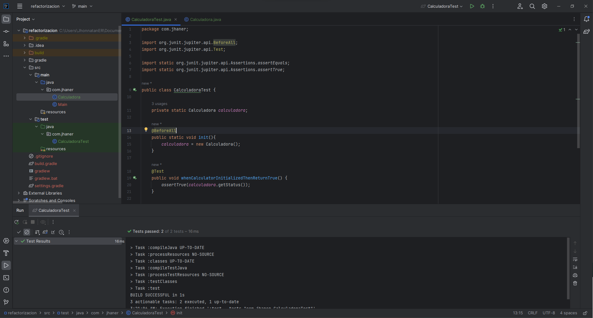
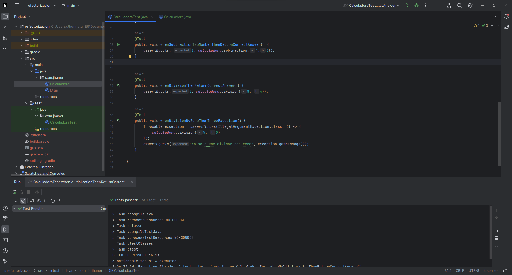
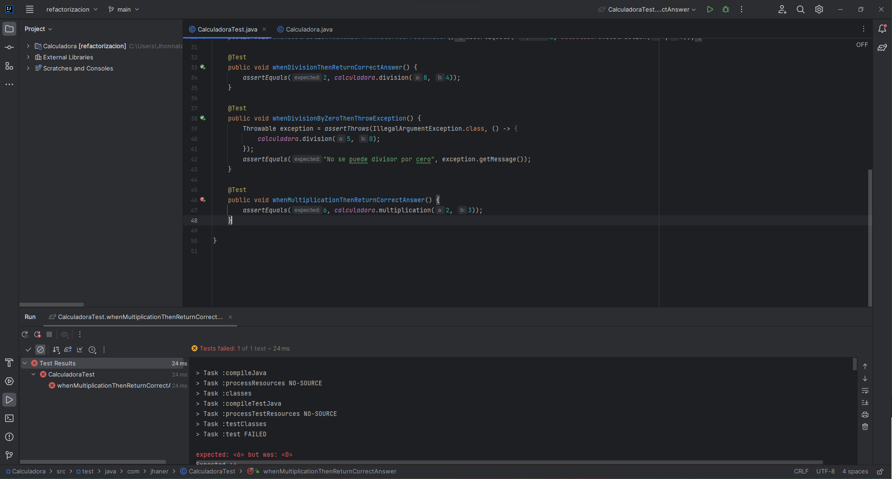
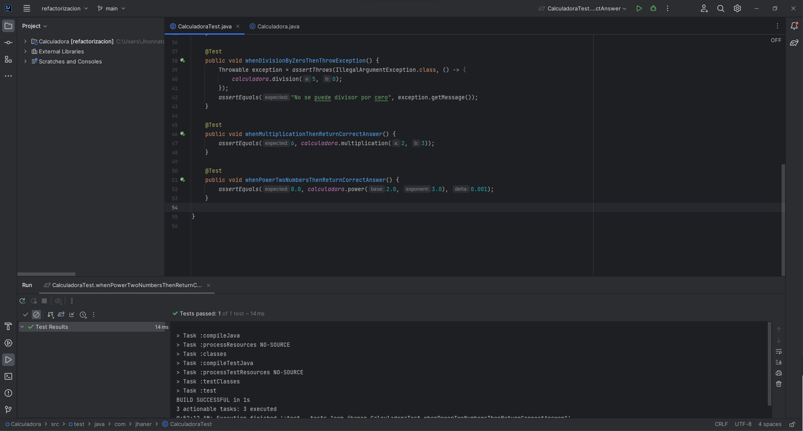
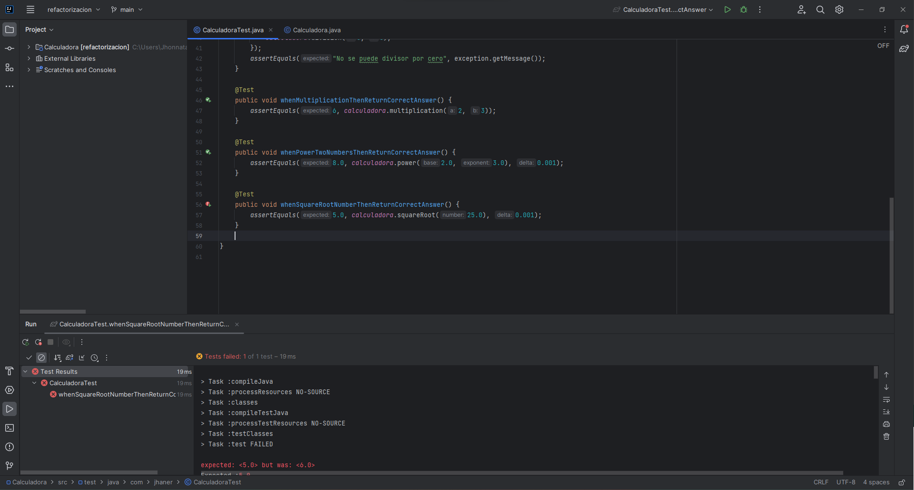
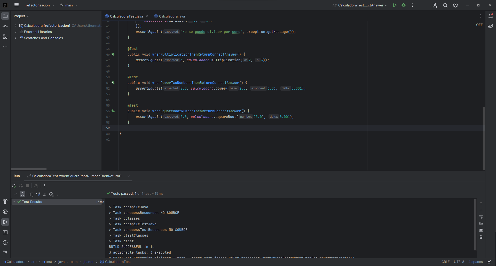
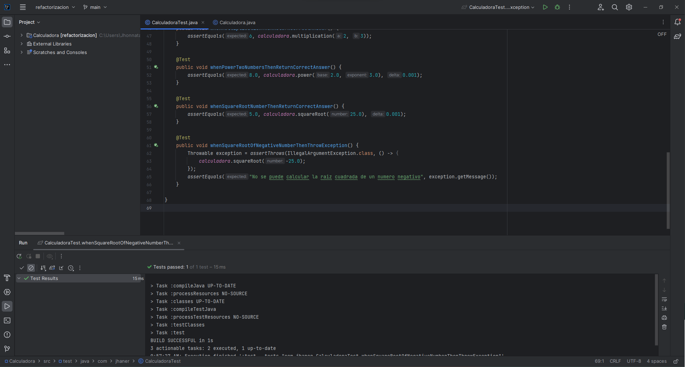

# Refactorización

## Requisito 1 
El estado de la calculadora es verdadero cuando se inicializa correctamente.

**Prueba de implementación**


## Requisito 2

La calculadora debe tener funciones de suma y resta.

**Prueba de implementación**



**Implementación de la función resta**

```java
public int subtraction(int a, int b) {
  return a - b;
}
```	


## Requisito 3

 La calculadora debe tener función de división.

**Prueba de implementación**



---

# Tarea
Agrega más funciones a la clase Calculadora utilizando los principios de TDD.

Primero definimos los requisitos que queremos implementar en la calculadora.

- Requisito 4: La calculadora debe tener función de multiplicación. 
- Requisito 5: La calculadora debe tener función de potencia.
- Requisito 6: La calculadora debe tener función de raíz cuadrada.

## Requisito 4
La calculadora debe tener función de multiplicación. 

**Creamos el Test**
```java
@Test
public void whenMultiplicationThenReturnCorrectAnswer() {
  assertEquals(6, calculadora.multiplication(2, 3));
}
```	

**Implementamos la función**
```java
public int multiplication(int a, int b) {
  return a * b;
}
```

Notamos que en este caso no es necesario refactorizar el código, ya que la implementación es simple y facil de entender y cubre los casos necesarios.

**Screenshot de RGR**

Test Rojo

Test Verde


## Requisito 5
La calculadora debe tener función de potencia.

**Creamos el Test**
```java
@Test
public void whenPowerTwoNumbersThenReturnCorrectAnswer() {
    assertEquals(8.0, calculadora.power(2.0, 3.0), 0.001);
}
```

**Implementamos la función**
```java
public double power(double base, double exponent) {
    return Math.pow(base, exponent);
}
```

En este caso tampoco es necesario refactorizar el código, ya que la implementación es simple y facil de entender y cubre los casos necesarios.

**Screenshot de RGR**

Test Rojo

Test Verde


## Requisito 6
La calculadora debe tener función de raíz cuadrada.

**Creamos el Test**
```java
@Test
public void whenSquareRootNumberThenReturnCorrectAnswer() {
    assertEquals(5.0, calculadora.squareRoot(25.0), 0.001);
}
```

**Implementamos la función**
```java
public double squareRoot(double number) {
    return Math.sqrt(number);
}
```

**Refactorización**

En este caso si vemos necesario el uso de la refatorización, ya que existe un caso en el que la raíz cuadrada de un número no existe (cuando se ingresa un número negativo), por lo que se debe lanzar una excepción.

Refactorizamos nuestro antiguo metodo **squareRoot()**.
```java
public double squareRoot(double number) {
  if (number < 0) {
    throw new IllegalArgumentException("No se puede calcular la raíz cuadrada de un número negativo");
  } else {
    return Math.sqrt(number);
  }
}
```

Creamos un nuevo test
```java
@Test
public void whenSquareRootOfNegativeNumberThenThrowException() {
    Throwable exception = assertThrows(IllegalArgumentException.class, () -> {
        calculadora.squareRoot(-25.0);
    });
    assertEquals("No se puede calcular la raíz cuadrada de un número negativo", exception.getMessage());
}
``` 

**Screenshot de RGR**

Test Rojo

Test Verde

Refactorizacion



