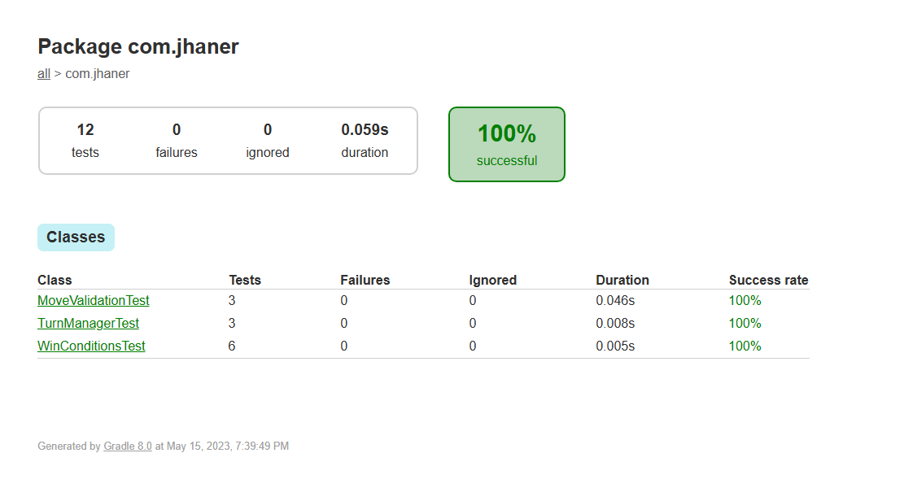
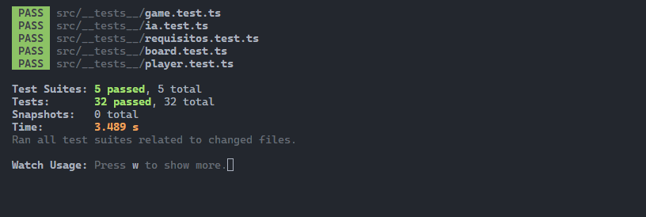
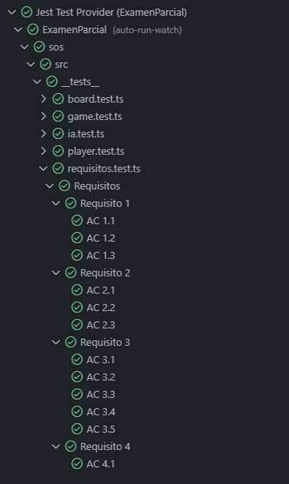
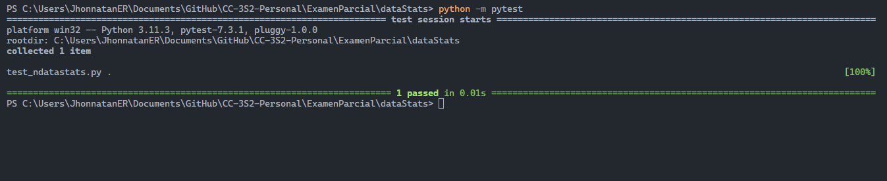
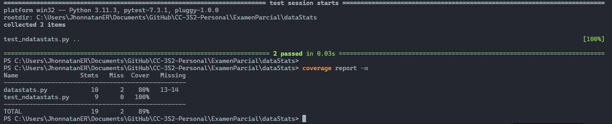
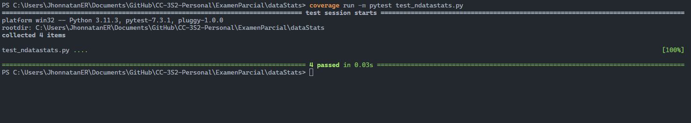
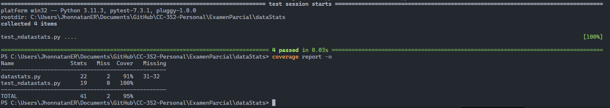

# Examen Parcial CC-3S2

**Autor:** Jhonnatan Espinoza Rojas.

**Fecha:** 2023-05-15.

## Pregunta 1

### Codigo sin refactorizar

#### Clase Main
```java
public static void main(String[] args) {
    List<Member> miembros = List.of(
        new PremiumMember("Abejita Azul"),
        new VipMember("Kaperucita Feliz"),
        new FreeMember("Inspectora Motita")
    );
}
```

#### Clase Member
```java
public abstract class Member {
    private final String name;
    public Member(String nombre) {
        this.name = nombre;
    }
    public abstract void joinTournament();
    public abstract void organizeTournament();
}
```

#### Clase PremiumMember
```java
public class PremiumMember extends Member {
    public PremiumMember(String nombre) {
        super(nombre);
    }

    @Override
    public void joinTournament() {
        System.out.print("...");
    }

    @Override
    public void organizeTournament() {
        System.out.print("...");
    }

}
```

#### Clase VipMember
```java
public class VipMember extends Member {

    public VipMember(String nombre) {
        super(nombre);
    }

    @Override
    public void joinTournament() {
        System.out.print("...");
    }

    @Override
    public void organizeTournament() {
        System.out.print("...");
    }

}
```

#### Clase FreeMember
```java
public class FreeMember extends Member{

    public FreeMember(String nombre) {
        super(nombre);
    }

    @Override
    public void joinTournament() {
        System.out.print("...");
    }

    @Override
    public void organizeTournament() {
        System.out.print("No se puede realizar torneos");
    }

}
```

### Codigo Refactorizado

#### Clase Member
Primero removemos de nuestra clase Members el metodo `organizeTournament()`.
```java
public abstract class Member {
    private final String name;
    public Member(String nombre) {
        this.name = nombre;
    }
    public abstract void joinTournament();
    
}
```

#### Clase TournamentStaff
Luego creamos una interface TournamentStaff que implemente el metodo `organizeTournament()`.
```java
public interface TournamentStaff {

    void organizeTournament();

}
```

#### Clase PremiumMember
Implementamos el metodo `organizeTournament()` en las clases que si pueden realizar torneos.
```java
public class PremiumMember extends Member implements TournamentStaff {
    public PremiumMember(String nombre) {
        super(nombre);
    }

    @Override
    public void joinTournament() {
        System.out.print("...");
    }

    @Override
    public void organizeTournament() {
        System.out.print("...");
    }

}
```

#### Clase VipMember
```java
public class VipMember extends Member implements TournamentStaff{

    public VipMember(String nombre) {
        super(nombre);
    }

    @Override
    public void joinTournament() {
        System.out.print("...");
    }

    @Override
    public void organizeTournament() {
        System.out.print("...");
    }

}
```

#### Clase FreeMember
De esta forma podemos tener la clase `FreeMember` que no implemente la interface `TournamentStaff`.
```java
public class FreeMember extends Member{

    public FreeMember(String nombre) {
        super(nombre);
    }

    @Override
    public void joinTournament() {
        System.out.print("...");
    }

}
```

Con esto podemos obtener un codigo compatible por el principio de **sustitucion de Liskov (LSP)**, ya que podemos sustituir la clase padre por cualquiera de sus clases hijas sin que el programa se vea afectado.

## Pregunta 2

### Requisito 1: colocación de piezas

#### Historia de Usuario
Como jugador, quiero poder colocar una pieza en cualquier espacio vacio del tablero de 3x3 para poder jugar el juego.

#### Criterios de Aceptacion
```
AC 1.1 limites del tablero I
CUANDO una pieza se coloca en cualquier lugar fuera del eje x, 
ENTONCES el sistema lanza una RuntimeException.
```

```
AC 1.2 limites del tablero II
CUANDO una pieza se coloca en cualquier lugar fuera del eje y, 
ENTONCES el sistema lanza una RuntimeException.
```

```
AC 1.3 lugar ocupado
CUANDO una pieza se coloca en un espacio ocupado,
ENTONCES el sistema lanza una RuntimeException.
```

#### Pruebas Unitarias

##### Prueba - limites del tablero I
```java
@Test
void testRuntimeExceptionWhenXPositionOutOfRange() {
    Assertions.assertThrows(RuntimeException.class, () -> {
        Game game = new Game();
        game.makeMove(-1,1);
    });
}
```

##### Prueba - limites del tablero II
```java
@Test
void testRuntimeExceptionWhenYPositionOutOfRange() {
    Assertions.assertThrows(RuntimeException.class, () -> {
        Game game = new Game();
        game.makeMove(1,4);
    });
}
```

##### Prueba - lugar ocupado
```java
@Test
void testRuntimeExceptionWhenNotEmptyCell() {
    Assertions.assertThrows(RuntimeException.class, () -> {
        Game game = new Game();
        game.makeMove(1,1);
        game.makeMove(1,1);
    });
}
```

### Requisito 2: agregar soporte para dos jugadores

#### Historia de Usuario
Como jugador, quiero que el sistema determine que jugador debe jugar a continuacion en el juego

#### Criterios de Aceptacion
```
AC 2.1 X juega primero
CUANDO inicia el juego el primer turno
ENTONCES debe de jugarlo el jugador X.
```

```
AC 2.2 O juega justo despues de X
CUANDO el ultimo turno fue jugado por X,
ENTONCES debe cambiar al turno del jugador O.
```

```
AC 2.3 X juega justo despues de O
CUANDO el ultimo turno fue jugado por O,
ENTONCES debe cambiar al turno del jugador X.
```

#### Pruebas Unitarias

##### Prueba - X juega primero
```java
@Test
void testPlayerXPlaysFirstTurn(){
    Assertions.assertEquals(game.getCurrentLetter(), Letter.CROSS);
}
```

##### Prueba - O juega justo después de X
```java
@Test
void testPlayerOTurnAfterPlayerX(){
    Assertions.assertEquals(game.getCurrentLetter(), Letter.CROSS);
    game.changeTurn();
    Assertions.assertEquals(game.getCurrentLetter(), Letter.NOUGHT);
}
```

##### Prueba - X juega justo después de O
```java
@Test
void testPlayerXTurnAfterPlayerO() {
    Assertions.assertEquals(game.getCurrentLetter(), Letter.CROSS);
    game.changeTurn();
    Assertions.assertEquals(game.getCurrentLetter(), Letter.NOUGHT);
    game.changeTurn();
    Assertions.assertEquals(game.getCurrentLetter(), Letter.CROSS);
}
```

### Requisito 3: agregar condiciones ganadoras

#### Historia de Usuario

Como jugador, quiero que el sistema determine si un jugador ha ganado el juego.

#### Criterios de Aceptacion

```
AC 3.1 por defecto no hay ganador
CUANDO no se cumple ninguna condicion ganadora,
ENTONCES no hay un ganador del juego.
```

```
AC 3.2 condicion ganadora I
CUANDO toda la linea horizontal esta ocupada por las piezas del jugador actual,
ENTONCES el jugador ha ganado el juego.
```

```
AC 3.3 condicion ganadora II
CUANDO toda la linea vertical esta ocupada por las piezas del jugador actual,
ENTONCES el jugador ha ganado el juego.
```

```
AC 3.4 condicion ganadora III
CUANDO toda la linea diagonal principal esta ocupada por las piezas del jugador actual,
ENTONCES el jugador ha ganado el juego.
```

```
AC 3.5 condicion ganadora IV
CUANDO toda la linea diagonal secundaria esta ocupada por las piezas del jugador actual,
ENTONCES el jugador ha ganado el juego.
```

#### Pruebas Unitarias

##### Prueba - por defecto no hay ganador
```java
@Test
void testGameInProgress(){
    game.makeMove(1,1);
    Assertions.assertEquals(GameState.PLAYING, game.getGameState());
}
```

##### Prueba - condicion ganadora I
```java
@Test
void testGameEndsWithHorizontalWin(){
    game.makeMove(0,0); // X
    game.makeMove(1,1); // O
    game.makeMove(0,1); // X
    game.makeMove(2,2); // O
    game.makeMove(0,2); // X
    Assertions.assertEquals(GameState.CROSS_WON, game.getGameState());
}
```


##### Prueba - condicion ganadora II
```java
@Test
void testGameEndsWithVerticalWin(){
    game.makeMove(0,0); // X
    game.makeMove(0,1); // O
    game.makeMove(0,2); // X
    game.makeMove(1,1); // O
    game.makeMove(2,2); // X
    game.makeMove(2,1); // O
    Assertions.assertEquals(GameState.NOUGHT_WON, game.getGameState());
}
```

##### Prueba - condicion ganadora III
```java
@Test
void testGameEndsWithPrimaryDiagonalWin(){
    game.makeMove(0,0); // X
    game.makeMove(0,1); // O
    game.makeMove(1,1); // X
    game.makeMove(0,2); // O
    game.makeMove(2,2); // X
    Assertions.assertEquals(GameState.CROSS_WON, game.getGameState());
}
```

##### Prueba - condicion ganadora IV
```java
@Test
void testGameEndsWithSecondaryDiagonalWin() {
    game.makeMove(0, 2); // X
    game.makeMove(0, 0); // O
    game.makeMove(1, 1); // X
    game.makeMove(1, 0); // O
    game.makeMove(2, 0); // X
    Assertions.assertEquals(GameState.CROSS_WON, game.getGameState());
}
```

### Requisito 4: condiciones de empate

#### Historia de Usuario
Como jugador, quiero que el sistema determine si el juego termina en empate.

#### Criterios de Aceptacion

```
AC 4.1 manejo de una situacion de empate
CUANDO no hay mas movimientos disponibles en el tablero y no se ha cumplido ninguna de las condiciones ganadoras,
ENTONCES el juego termina en un empate.
```

#### Pruebas Unitarias

##### Prueba - manejo de una situacion de empate
```java
@Test
void testGameEndsWithDraw(){
    game.makeMove(0,0); // X
    game.makeMove(1,1); // O
    game.makeMove(1,0); // X
    game.makeMove(2,0); // O
    game.makeMove(0,2); // X
    game.makeMove(0,1); // O
    game.makeMove(2,1); // X
    game.makeMove(2,2); // O
    game.makeMove(1,2); // X
    Assertions.assertEquals(GameState.DRAW, game.getGameState());
}
```

### Covertura de codigo JaCoCo

Se uso la guia del examen y se agrego al `build.graddle` las siguientes lineas de codigo:

```java
apply plugin: 'jacoco'
```

Lo que nos genero un build con un reporte de covertura de codigo, el cual se puede ver en la siguiente imagen:



## Pregunta 3

Actualmente usamos nextJS, un framework de JS que utiliza React, este framework nos brinda la estructura de las carpetas, nextjs en su documentacion nos pide que los test se almacenen dentro de la carpeta `src\__tests__` y que los archivos de test terminen con `.test.js` o `.test.ts`. 

Utilizaremos una clase de test llamada `requisitos.test.ts` de manera temporal para el desarrollo de los requisitos del examen (aunque ).

### Requisito 1: colocación de piezas

#### Criterios de Aceptacion
```
AC 1.1 limites del tablero I
CUANDO una pieza se coloca en cualquier lugar fuera del eje x, 
ENTONCES el sistema lanza una RuntimeException.
```

```
AC 1.2 limites del tablero II
CUANDO una pieza se coloca en cualquier lugar fuera del eje y, 
ENTONCES el sistema lanza una RuntimeException.
```

```
AC 1.3 lugar ocupado
CUANDO una pieza se coloca en un espacio ocupado,
ENTONCES el sistema lanza una RuntimeException.
```

#### Pruebas Unitarias

##### Prueba - limites del tablero I
```typescript
test("AC 1.1", () => {
    expect(() => {
        game.makeMove(-1, 0, Letter.S);
    }).toThrowError("Invalid position.");
});
```

##### Prueba - limites del tablero II
```typescript
test("AC 1.2", () => { 
    expect(() => {
        game.makeMove(1, 4, Letter.S);
    }).toThrowError("Invalid position.");
});
```

##### Prueba - lugar ocupado
```typescript
test("AC 1.3", () => {
    game.makeMove(0, 0, Letter.S);
    expect(() => {
        game.makeMove(0, 0, Letter.S);
    }).toThrowError("Cell is not empty.");
});
```

### Requisito 2: agregar soporte para dos jugadores

#### Criterios de Aceptacion
```
AC 2.1 X juega primero
CUANDO inicia el juego el primer turno
ENTONCES debe de jugarlo el Player 1.
```

```
AC 2.2 Player 2 juega justo despues de Player 1
CUANDO el ultimo turno fue jugado por el Player 1,
ENTONCES debe cambiar al turno del Player 2.
```

```
AC 2.3 Player 1 juega justo despues del Player 2
CUANDO el ultimo turno fue jugado por el Player 2,
ENTONCES debe cambiar al turno del Player 1.
```

#### Pruebas Unitarias

##### Prueba - Player 1 juega primero
```typescript
test("AC 2.1", () => {
    expect(game.getCurrentPlayer()).toBe(players[0]);
});
```

##### Prueba - Player 2 juega justo despues de Player 1
```typescript
test("AC 2.2", () => {
    game.makeMove(0, 0, Letter.S);
    expect(game.getCurrentPlayer()).toBe(players[1]);
});
```

##### Prueba - Player 1 juega justo despues del Player 2
```typescript
test("AC 2.3", () => {
    game.makeMove(0, 0, Letter.S);
    game.makeMove(0, 1, Letter.O);
    expect(game.getCurrentPlayer()).toBe(players[0]);
});
```

### Requisito 3: agregar condiciones ganadoras

#### Criterios de Aceptacion

```
AC 3.1 por defecto no hay ganador
CUANDO no se cumple ninguna condicion ganadora,
ENTONCES no hay un ganador del juego.
```

```
AC 3.2 condicion ganadora I
CUANDO toda la linea horizontal esta ocupada por las piezas del jugador actual,
ENTONCES el jugador ha ganado el juego.
```

```
AC 3.3 condicion ganadora II
CUANDO toda la linea vertical esta ocupada por las piezas del jugador actual,
ENTONCES el jugador ha ganado el juego.
```

```
AC 3.4 condicion ganadora III
CUANDO toda la linea diagonal principal esta ocupada por las piezas del jugador actual,
ENTONCES el jugador ha ganado el juego.
```

```
AC 3.5 condicion ganadora IV
CUANDO toda la linea diagonal secundaria esta ocupada por las piezas del jugador actual,
ENTONCES el jugador ha ganado el juego.
```

#### Pruebas Unitarias

##### Prueba - por defecto no hay ganador
```typescript
test("AC 3.1", () => {
    expect(game.getGameOver()).toBe(false);
});
```

##### Prueba - condicion ganadora I
```typescript
test("AC 3.2", () => {
    game.makeMove(0, 0, Letter.S); // player 1
    game.makeMove(0, 1, Letter.O); // player 2
    game.makeMove(0, 2, Letter.S); // player 1
    expect(game.getWinner()).toBe(players[0]);
});
```

##### Prueba - condicion ganadora II
```typescript
test("AC 3.3", () => {
    game.makeMove(0, 0, Letter.S); // player 1
    game.makeMove(1, 0, Letter.O); // player 2
    game.makeMove(2, 0, Letter.S); // player 1
    expect(game.getWinner()).toBe(players[0]);
});
```

##### Prueba - condicion ganadora III
```typescript
test("AC 3.4", () => { 
    game.makeMove(0, 0, Letter.S); // player 1
    game.makeMove(1, 1, Letter.O); // player 2
    game.makeMove(2, 1, Letter.O); // player 1
    game.makeMove(2, 2, Letter.S); // player 2
    expect(game.getWinner()).toBe(players[1]);
});
```

##### Prueba - condicion ganadora IV
```typescript
test("AC 3.5", () => {
    game.makeMove(0, 2, Letter.S); // player 1
    game.makeMove(1, 1, Letter.O); // player 2
    game.makeMove(2, 1, Letter.O); // player 1
    game.makeMove(2, 0, Letter.S); // player 2
    expect(game.getWinner()).toBe(players[1]);
});
```

### Requisito 4: condiciones de empate

#### Criterios de Aceptacion

```
AC 4.1 manejo de una situacion de empate
CUANDO no hay mas movimientos disponibles en el tablero y no se ha cumplido ninguna de las condiciones ganadoras,
ENTONCES el juego termina en un empate.
```

#### Pruebas Unitarias

##### Prueba - manejo de una situacion de empate
```typescript
test("AC 4.1", () => {
    game.makeMove(0, 0, Letter.S); // player 1
    game.makeMove(0, 1, Letter.S); // player 2
    game.makeMove(0, 2, Letter.S); // player 1
    game.makeMove(1, 0, Letter.S); // player 2
    game.makeMove(1, 1, Letter.S); // player 1
    game.makeMove(1, 2, Letter.S); // player 2
    game.makeMove(2, 0, Letter.S); // player 1
    game.makeMove(2, 1, Letter.S); // player 2
    game.makeMove(2, 2, Letter.S); // player 1
    expect(() => game.getWinner()).toThrow("Draw.");
});
```


### Imagenes de las pruebas unitarias

A continuacion se muestran las imagenes de las pruebas unitarias ejecutadas en el proyecto.

Jest ejecutado en consola



Resultados en verde




## Pregunta 4

### ¿Qué son las pruebas efectivas y sistemáticas?

Las pruebas efectivas y sistematicas son pasos a seguir para generar un conjunto de casos de prueba efectivos que son lo suficientemente fuerte como para detectar los errores mas importantes mientras omitimos las pruebas que realmente no importan o no agregan valor.

- Utilizando los requerimientos del sistema
- Creando pruebas estructurales y codigo de cobertura
- Explorando las posibles propiedades del programa
- Realizando pruebas unitarias y de integracion

### Pruebas

(a) Comienza a implementar una estrategia de prueba sistemática para esta función escribiendo una buena partición del espacio de entrada solo en el limite de entrada, es decir, la partición no debe mencionar ni el texto ni el delimitador

#### Requerimientos del sistema

- La funcion `split` debe retornar una lista con los elementos del string separados por el delimitador, si el limite es positivo, solo hasta el limite especificado
- La funcion `split` debe retornar una lista con los elementos del string separados por el delimitador, pero solo hasta el limite especificado, si el limite es negativo no hay limite superior
- La funcion `split` debe retornar una lista con los elementos del string separados por el delimitador, pero solo hasta el limite especificado, si el limite es igual a cero, no hay limite superior

#### Particion del limite de entrada

Podemos comenzar con una particion de entrada que contenga los siguientes casos:

Particion de entrada:
- Limite positivo: `limite > 0`
- Limite negativo: `limite < 0`
- Limite igual a cero: `limite = 0`

#### Pruebas unitarias

```java
@Test
void testSplitWithLimitPositive() {
    List<String> res = split("a|b|c", '|', 2);
    Assertions.assertEquals(Arrays.asList("a", "b|c"), res);
}

@Test
void testSplitWithLimitNegative() {
    List<String> res = split("a|b|c", '|', -1);
    Assertions.assertEquals(Arrays.asList("a", "b", "c"), res);
}

@Test
void testSplitWithLimitZero() {
    List<String> res = split("a|b|c", '|', 0);
    Assertions.assertEquals(Arrays.asList("a", "b", "c"), res);
}
```

(b) Ahora, escriba una buena partición del espacio de entrada sobre la relación entre el límite y las ocurrencias del delimitador en el texto. Tu partición debe mencionar las tres entradas.

#### Particion de la relacion entre el limite y las ocurrencias del delimitador en el texto

Limite positivo `limite > 0`:

- Caso 1: El delimitador no aparece en el texto.
- Caso 2: El delimitador aparece en el texto menos veces que el valor del limite.
- Caso 3: El delimitador aparece exactamente el mismo numero de veces que el valor del limite en el texto.
- Caso 4: El delimitador aparece mas veces que el valor del limite en el texto.

Limite negativo `limite < 0`:

- Caso 5: El delimitador no aparece en el texto.
- Caso 6: El delimitador aparece al menos una vez en el texto.

Limite igual a cero `limite = 0`:

- Caso 7: El delimitador no aparece en el texto.
- Caso 8: El delimitador aparece al menos una vez en el texto.

### Refactorización Avanzada

#### Escribe la nueva clase NdataStats en el archivo datastats.py y comprueba si la prueba anterior pasa

```python
class NDataStats:
    def __init__(self, data):
        self.data = data
```

Podemos notar en la imagen que con el codigo proporcionado la prueba sale en verde .



#### Edita los archivos necesarios para ejecutar la prueba.¿Cuál es el código de cobertura para este ejemplo ?

La covertura de codigo es del 80% en el archivo `datastats.py` y del 100% en el archivo `test_datastats.py`.



#### Edita los archivos necesarios para ejecutar la prueba.¿Cuál es el código de cobertura para este ejemplo.?

##### Archivo datastats.py
Siguiendo la guia del examen usamos las funciones brindadas pero le agregamos una funcion para remover el signo de dolar del salario ejm: ($24453) para convertirlo en un int ademas de agregar la funcion _salarios con el fin de obtener una lista de los salarios de los empleados.

```python
def remove_dollar_sign(salario):
    return int(salario.replace('$', ''))

class NDataStats:
    
    def __init__(self, data):
        self.data = data

    @property
    def _edades(self):
        return [d['edad'] for d in self.data]
    
    @property
    def _salarios(self):
        return [remove_dollar_sign(d['salario']) for d in self.data]
    
    def _promedio_floor(self, suma_de_numeros):
        return math.floor(suma_de_numeros / len(self.data))
    
    def _salario_promedio(self):
        return self._promedio_floor(sum(self._salarios))
    
    def _edad_promedio(self):
        return self._promedio_floor(sum(self._edades))

class DataStats:
    
    def stats(self, data, iedad, isalario):
        nds = NDataStats(data)
        return nds.stats(iedad, isalario)
```

#####  Test del archivo test_ndatatstats.py:
En este archivo agregamos 4 pruebas para verificar que las funciones de la clase NDataStats funcionen correctamente.
por lo cual se calculo el salario promedio y la edad promedio de manera manual para verificar que los resultados sean los mismos.

```python
def test_init():
    ds = NDataStats(test_data)
    assert ds.data == test_data

def test_edades():
    ds = NDataStats(test_data)
    assert ds._edades == [68, 49, 70]

def test_salario_promedio():
    ds = NDataStats(test_data)
    assert ds._salario_promedio() == 55165

def test_edad_promedio():
    ds = NDataStats(test_data)
    assert ds._edad_promedio() == 62

# Pruebas
test_init()
test_edades()
test_salario_promedio()
test_edad_promedio()
```

#### Covertura de codigo

Aqui podemos ver como pasa los test en verde



Ademas aqui usamos `coverage report -m` para ver la covertura de codigo donde vemos que el archivo `datastats.py`



